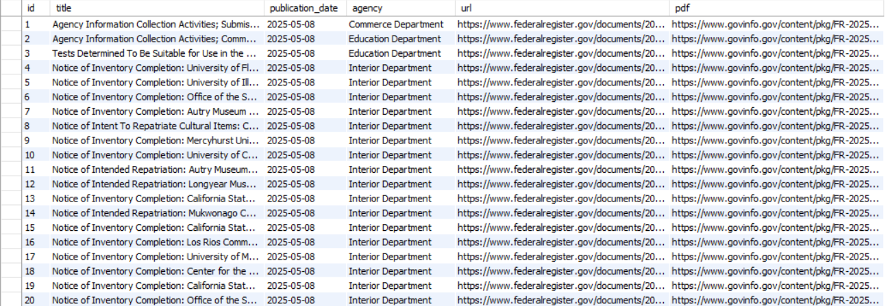

# Overview
Retrieval-Augmented Generation (RAG) system designed to allow users to interact with the Federal Register dataset via a natural language interface. The system integrates a local LLM (Qwen 0.5B via Ollama), semantic search using FAISS, and a daily-updated MySQL database, enabling accurate and up-to-date responses based on real government publications.

# Features
`Agentic Chat System:` Users can ask natural language questions; the LLM responds using tools (function calls) instead of directly querying APIs

`Data Pipeline:` Automatically fetches and processes documents from the Federal Register API and stores them in a local MySQL database

`Semantic Search:` Uses SentenceTransformers + FAISS to find the most relevant documents

`Local LLM Inference:` Uses **Qwen 0.5B** model through the Ollama platform

`Streamlit UI:` User interface to chat with the agent in real time

# Tech Stack

FAISS – for vector-based retrieval

MySQL – for structured document storage

Ollama + Qwen 0.5B – for local LLM responses

aiohttp + aiomysql – fully async data pipeline

Sentence Transformers – for document embedding

Streamlit – for the chat interface

# Usage: 

```
pip install -r requirements.txt
```

```
streamlit run main.py
```

# Example:

Fedral Register DB:



RAG - BOT:


